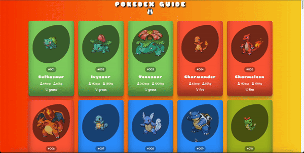

<h1>pokedex-guide</h1>

Title: "Pokémon Guide: A Responsive Project Created with HTML, CSS, and JavaScript

Description:
I would like to share with you a project I developed using HTML, CSS, and JavaScript to create a guide for exploring the Pokémon world. 🌐

In my project, I utilized the popular PokeAPI to create a separate card for each Pokémon. Each card contains detailed information about the Pokémon, and users can quickly access their desired Pokémon card using the search button. 💻

Thanks to responsive design, my project smoothly adapts to different screen sizes, ensuring seamless functionality across various platforms, from mobile devices to computers. 📱💻

<h1>library</h1>

The Font Awesome library made it easy for me to add various icons to my project. These icons enhanced the user experience and added a dynamic touch to the project. 

<h1>screenshot</h1>

